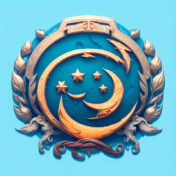

# Team Page

## Team Name: Blue Moon 30-ers

## Our Core Values
- Know when to work hard and when to hardly work.
- Communicate anything and everything.
- Learn as much as possible about the SWE process.
- Have each other's backs.
- Have fun.

## Our Roster
- [Pratyush Chand](https://pratyush1718.github.io/cse110Proj/): 2nd-year CS Major, Sixth College. Loves to play the drums, box, and repeatedly watch the office.
- [Peter Lu](https://pthaha.github.io/CSE110/): 3rd-year CS Major, Revelle College. Loves bouldering and video games. I make decent beef noodle soup.
- [Eric Dong](https://e81786.github.io/User-Page/): 3rd-year Cog Sci Major - ML Spec, Sixth College. Likes swimming and playing the cello and guitar.
- [Jaemin Ko](https://jaemin-capslock.github.io/cse_110_lab1/): 2nd-year CE Major, ERC. Wannabe trilingual, pianist, bartender and cook. Has subtle grandpa/parisian aesthetic. Loves Bobcats.
- [Georgio Feghali](https://georgiofe.github.io/cse110-software-engineering/): 3rd year CE major. Loves to play basketball and to watch Formula 1. Quadrilingual Mediterranean Prodigy.
- [Ryan Wong] (https://github.com/ry4nwong): 3rd year CS Major in Revelle College by day, EDM/house DJ by night! Former baseball player that enjoys physical fitness and lifting.
